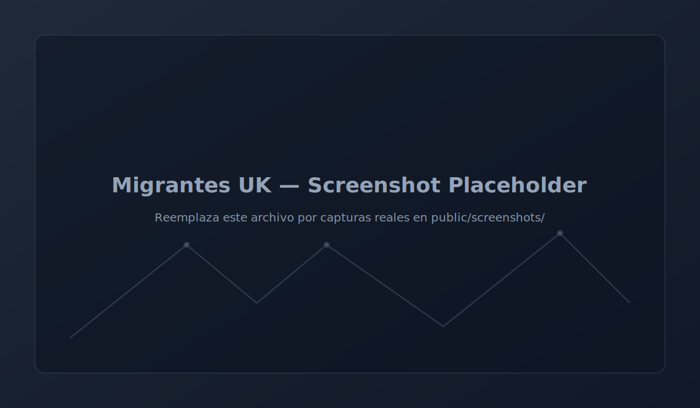

# Migrantes UK — PWA (Next.js + Firebase)

[](https://nextjs.org/docs/app)
[](https://www.typescriptlang.org/)
[](https://firebase.google.com/docs/web)
[](https://web.dev/learn/pwa/)
[](https://vercel.com/ganafacils-projects/migrantes-uk-pwa)
[](https://migrantes-uk-byeudna9m-ganafacils-projects.vercel.app)
[](https://pagespeed.web.dev/report?url=https%3A%2F%2Fmigrantes-uk-byeudna9m-ganafacils-projects.vercel.app)
[](https://pagespeed.web.dev/report?url=https%3A%2F%2Fmigrantes-uk-byeudna9m-ganafacils-projects.vercel.app)

PWA para apoyar a migrantes en el Reino Unido: formulario Q&A de asilo con validación y autosave, OCR/MRZ local de pasaporte, generación de PDF, subida de documentos a Firebase Storage, directorio curado con fuentes oficiales, asistente con FAQ + traducción, modo offline básico y notificaciones web (FCM). Funciona en iOS/Android vía “Add to Home Screen”.

## Características

- Autenticación con Firebase (email/anon), perfil y cierre de sesión
- Q&A de asilo con autosave en IndexedDB (Dexie) y envío a Firestore
- Generación de PDF en cliente (pdf-lib)
- Subida de documentos con progreso (Storage) y trazabilidad en Firestore
- OCR local (tesseract.js) y extracción MRZ (TD3/TD1)
- Directorio de ayuda con búsqueda y filtros (datos en Firestore)
- Asistente: FAQ + traducción LibreTranslate
- PWA: Runtime caching (next-pwa), offline básico, Add to Home Screen
- Notificaciones web (FCM) y guardado del token por usuario
- Componentes utilitarios: A2hsHint, EnableNotifications, OnlineSync, DeleteMyData, LegalBanner

## Tecnologías

- Next.js (App Router), TypeScript, Tailwind CSS, next-pwa
- Firebase: Auth, Firestore, Storage, Cloud Messaging (FCM)
- Dexie (IndexedDB), pdf-lib, tesseract.js
- LibreTranslate para traducción (auto/ES/EN)

## Estructura (principal)

```
src/
  app/
    login/        # Acceso / registro
    qna/          # Formulario de asilo
    letter/       # Generación de PDF
    upload/       # Subida + OCR/MRZ
    directory/    # Directorio de ayuda
    assistant/    # Asistente (FAQ + traducción)
    profile/      # Perfil y utilidades
    admin/        # Curado de directory/faq
  components/
    A2hsHint.tsx
    EnableNotifications.tsx
    OnlineSync.tsx
    LegalBanner.tsx
    DeleteMyData.tsx
  lib/
    firebase.ts
    db.ts            # Dexie
    pdf.ts
    storage.ts
    translate.ts
    notifications.ts
    ocr/mrz.ts
public/
  firebase-messaging-sw.js
```

## Variables de entorno (.env.local)

```env
NEXT_PUBLIC_FIREBASE_API_KEY=
NEXT_PUBLIC_FIREBASE_AUTH_DOMAIN=
NEXT_PUBLIC_FIREBASE_PROJECT_ID=
NEXT_PUBLIC_FIREBASE_STORAGE_BUCKET=
NEXT_PUBLIC_FIREBASE_MESSAGING_SENDER_ID=
NEXT_PUBLIC_FIREBASE_APP_ID=
NEXT_PUBLIC_FCM_VAPID_KEY=
NEXT_PUBLIC_LIBRETRANSLATE_URL=https://libretranslate.com/translate
```

## Desarrollo

```bash
npm install
npm run dev
# http://localhost:3000
```

## Capturas de pantalla

> Coloca tus imágenes en `public/screenshots/` y ajusta las rutas si cambias los nombres.

| Login | Q&A | PDF |
|---|---|---|
|  |  |  |

| Upload/OCR | Directory | Assistant |
|---|---|---|
|  |  |  |

## Demo

> Este bloque mostrará un GIF corto de la app en uso. Mientras tanto se usa un marcador temporal.


Reemplaza la imagen por `public/screenshots/demo.gif` cuando esté disponible.

## Rutas públicas y flujo

- /login: Acceso (email/registro) y modo invitado
- /qna: Formulario asilo (autosave IndexedDB, validación, “Enviar a la nube”)
- /letter: Generar PDF con datos del Q&A
- /upload: Subir PDF/pasaporte, OCR local, enviar MRZ al Q&A
- /directory: Búsqueda/filtrado, enlaces oficiales (gov.uk/ONGs)
- /assistant: FAQ + traducción; sugiere enlaces oficiales
- /profile: Perfil, “Eliminar mis datos” (IndexedDB + signOut)
- /admin: Curado de `directory` y `faq` (uso interno)

## PWA y caché

- Add to Home Screen en iOS/Android (A2hsHint)
- Service Worker de FCM: `public/firebase-messaging-sw.js`
- next-pwa con RuntimeCaching para imágenes, fuentes y rutas clave
- Verificado modo offline básico (datos guardados localmente)

## Privacidad y cumplimiento

- Banner Legal: “No es asesoría legal regulada. Información orientativa.”
- OCR/MRZ en dispositivo: no se suben imágenes salvo acción explícita del usuario
- Directorio y Asistente enlazan a fuentes oficiales (ej. `https://www.gov.uk`)
- Botón “Eliminar mis datos”: limpia IndexedDB y cierra sesión

## Despliegue (Vercel)

```bash
vercel login
vercel link
vercel --prod
```

- Configura las variables de entorno en Project Settings → Environment Variables
- Opcional: limpiar caché y volver a desplegar si cambias SW/PWA

## Despliegue (Firebase Functions + reglas)

Requisitos: Firebase CLI, `.firebaserc` con `default: migrantes-uk`, `firebase.json` en raíz, y `.env.local` con claves de Firebase Web.

```bash
# Compilar Functions
cd functions
npm ci
npm run build
cd ..

# Seleccionar proyecto y desplegar
firebase use migrantes-uk
firebase deploy --only "functions,firestore:rules"

# Despliegue por función específica (opcional)
firebase deploy --only "functions:getPublicCaseByCode"
```

Funciones incluidas:
- getPublicCaseByCode: devuelve datos públicos por CASE_CODE (vista /track/[code])
- reserveUserCode, reserveCaseCode: reserva códigos únicos
- onPaymentValidated: al validar pago, marca `cases/{caseId}.status = pagado` y notifica

Notas:
- Si es la primera vez, el CLI habilitará APIs (Cloud Functions, Build, Artifact Registry); reintenta tras 2–3 minutos.
- Si usas PowerShell, pon comillas en `--only "functions,firestore:rules"`.

## Plan de pruebas rápido

1) Crear caso: `/cases/new` → verifica `amount`, `paymentMethod: "whatsapp"`, `timeline` inicial
2) Ficha caso: `/cases/[id]` → muestra `CASE_CODE`, link “Ver como cliente ↗”, timeline y botón WhatsApp si `pendiente_pago`
3) Seguimiento público: `/track/CASE_CODE` → estado + timeline (sin PII via Cloud Function)
4) Paywall dashboard: botón WhatsApp dinámico con `CASE_CODE/amount` si hay `pendiente_pago`; si no, genérico. Link “Ver como cliente ↗” si hay `caseCode`
5) Admin: `/admin` → “Gestión de Casos” (`/admin/cases`) → búsqueda por `CASE_CODE`, plantillas WhatsApp, seguimiento público, reasignación (solo admin)
6) Validaciones: asesores leen solo `assignedTo`; no pueden cambiar `assignedTo/status/uid`. `onPaymentValidated` actualiza caso al validar pago.

## Mantenimiento de contenidos (Admin)

- `directory`: lista de organizaciones y enlaces (permitir solo dominios oficiales/ONGs reconocidas)
- `faq`: preguntas frecuentes bilingües (ES/EN). Si falta un idioma, se traduce al vuelo con LibreTranslate
- Revisión manual antes de publicar entradas nuevas o automatizadas (pendingReview → published)

## Roadmap sugerido

- Accesibilidad (auditoría completa WCAG)
- Roles de administrador y trazabilidad de cambios
- Firma digital simple en PDF y envío por correo
- Donaciones (Stripe/PayPal) con enlaces a sus páginas oficiales
- Sincronización de borradores multi-dispositivo

## Solución de problemas

- No muestra “Add to Home Screen”: abre en navegador compatible e interactúa unos segundos
- No llegan notificaciones: revisa permisos del navegador y `NEXT_PUBLIC_FCM_VAPID_KEY`
- Offline no funciona: vuelve a instalar la PWA tras desplegar cambios de SW

## Licencia y contacto

- Licencia MIT
- Contacto: soporte del proyecto (añadir email/canal preferido)
